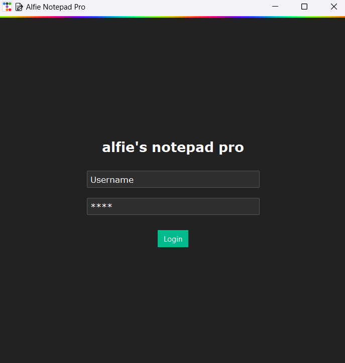
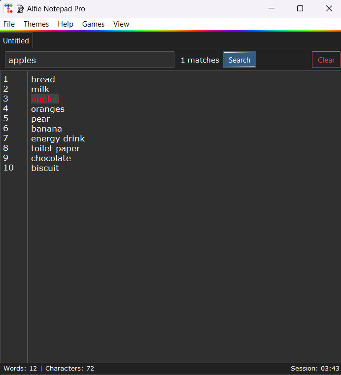

# 📝 Alfie Notepad Pro

A fully-featured, modern notepad application built with Python and `ttkbootstrap`. Includes autosave, syntax highlighting, tabbed editing, a login system, and even a built-in game!

---

## 🚀 Features

- ✅ Dark theme and customizable themes via menu
- 🔒 Login system with credential check
- 📁 Open, edit, and save `.txt` files
- 🧠 Real-time syntax highlighting (Python keywords)
- 💾 Autosave to `versions/` folder every 60 seconds
- 🧮 Word and character count
- 📆 Session duration tracker
- 🎮 Built-in game: Tic-Tac-Toe
- 🧹 Clear text, search and highlight
- 🧾 Toggleable line numbers

---

## 📸 Screenshots




---

## 🛠️ Built With

- [Python 3.x](https://www.python.org/)
- [ttkbootstrap](https://github.com/israel-dryer/ttkbootstrap)
- Standard Libraries: `tkinter`, `os`, `math`, `time`

---

## 📦 Setup

1. Clone this repository:
    ```bash
    git clone https://github.com/yourusername/alfie-notepad-pro.git
    cd alfie-notepad-pro
    ```

2. Install dependencies:
    ```bash
    pip install -r requirements.txt
    ```

3. Run the app:
    ```bash
    python alfienotepad.py
    ```

---

## 📁 Project Structure

